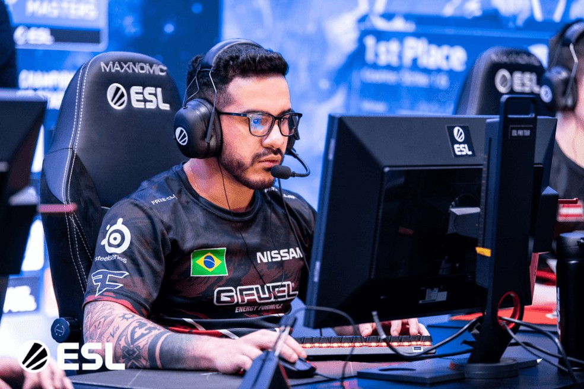

<h1 align="center">Análise de dados da CS-GO</h1>

Nesse projeto análisei uma base de dados de pro playres brasileiro de Counter Strike e busquei a avaliar os kd, kd diff e rating para trazer alguns jogadores destaque

<h1 align="center">
    
🚀Linguagem usada no projeto

     <a href="">🔗 Python</a>
</h1>

# 🎲 informação
Esse projeto eu fiz no intuito de praticar e trazer uma visulização diferente com imganes e dados externos.

# 📃dados
link: <a href="https://www.kaggle.com/patrasaurabh/csgo-player-and-team-stats">Base Counter strike</a>

# Resultado

## dicionário das colunas
coluna 'nome': Se refere ao nick do jogadores no jogo.

coluna 'pais': Se refere a nacionalidade do jogador.

coluna 'times': Se refere aos times que o jogador jogou.

coluna 'total mapas': Se refere ao total de mapas jogados

coluna 'total rounds': Se refere ao total de rounds jogados

coluna 'kd diff': Se refere diferença existente entre os abates e as mortes.

coluna 'kd': Se refere a taxa Kills/Deaths (K/D)

coluna 'rating': Se refere a uma estatística que ajuda medir a performance e resultados de jogadores
 
## Análise dos jogadores com mais mapas jogados
<h4>Top 10 de jogadores com mais mapas jogados:</h4>

 
<h4>Top 5 de jogadores com os kd mais alto:</h4>

 
<h4>Top 5 de jogadores com o kd diff mais alto:</h4>

 
<h4>Top 5 de jogadores com o kd diff mais alto:</h4>

 
<h4>Top 10 de jogadores com o rating mais alto:</h4>

 
<h4>Jogador destaque entre o top 10 de mais mapas jogados:</h4>

nome: Marcelo David(coldzera)

nick: coldzera

mais mapas jogados: 3° lugar

kd: 1° lugar

kd diff: 1° lugar

rating: 1° lugar

hltv(perfil completo): <a href="https://www.hltv.org/player/9216/coldzera">hltv coldzera</a>

observação: 2 x Major winner(campeão mundial) e 2 x Major MVP(melhora jogador)

 
<h1>Análise de todos os jogadores</h1>

<h4>Top 10 jogadores com o kd mais alto</h4>

 
<h4>Top 5 jogadores com kd diff mais alto</h4>

 
<h4>Top 1o jogadores com o rating mais alto</h4>

 
<h4>Jogador destaque :</h4>

nome: Rafael Costa(saffee)
 

nick: saffee
 

kd: 1° lugar
 

rating: 1° lugar
 

hltv(perfil completo): <a href="https://www.hltv.org/player/18835/saffee#tab-infoBox">hltv saffe</a>
 

observação: Jogador novo e sem muitos títitulos mas com números altos podendo ser uma grande promessa
 

